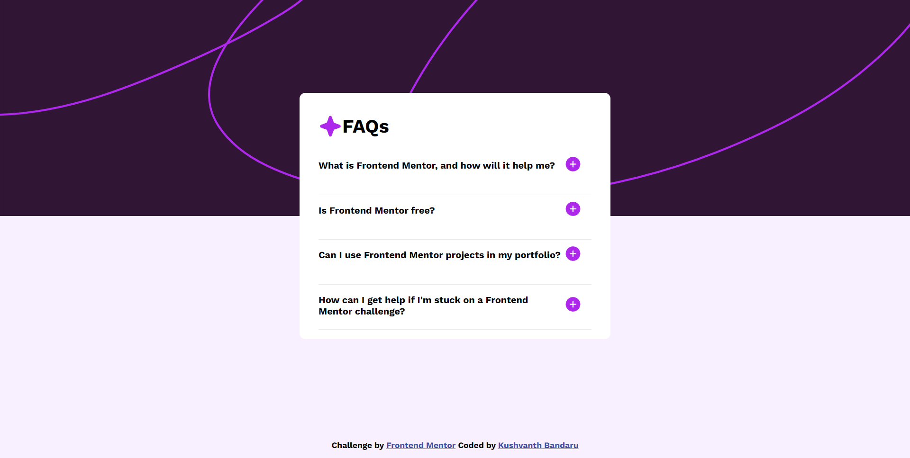
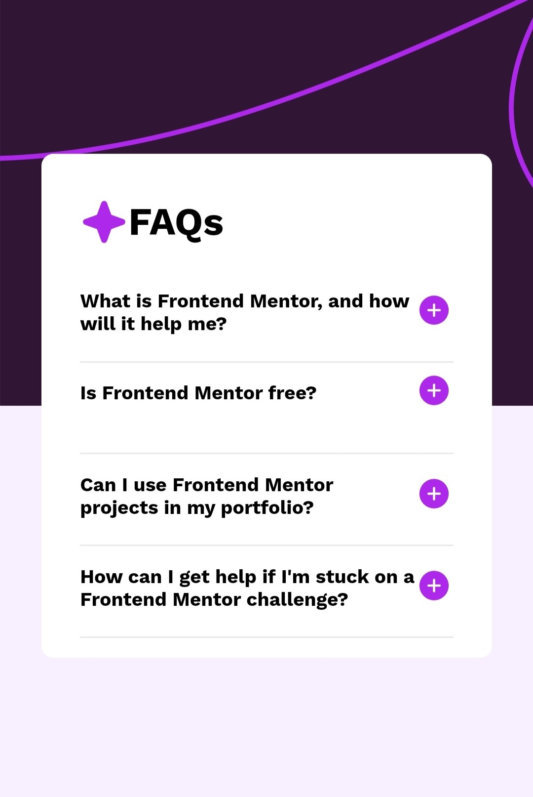

# Frontend Mentor - FAQ accordion solution

This is a solution to the [FAQ accordion challenge on Frontend Mentor](https://www.frontendmentor.io/challenges/faq-accordion-wyfFdeBwBz). Frontend Mentor challenges help you improve your coding skills by building realistic projects. 

## Overview

### The challenge

Users should be able to:

- Hide/Show the answer to a question when the question is clicked
- Navigate the questions and hide/show answers using keyboard navigation alone
- View the optimal layout for the interface depending on their device's screen size
- See hover and focus states for all interactive elements on the page

### Screenshot
Desktop view:

Responsive view:

### Links

- Solution URL: [Github repo](https://github.com/Kushvanth03/Frontendmentor-faq)
- Live Site URL: [Live site](https://kushvanth03.github.io/Frontendmentor-faq/)

## My process

### Built with

- Semantic HTML5 markup
- CSS custom properties
- Flexbox
- Mobile-first workflow
- JavaScript

## Author

- Frontend Mentor - [@Kushvanth03](https://www.frontendmentor.io/profile/Kushvanth03)
- Twitter - [@Kushvanthtwt](https://www.twitter.com/Kushvanthtwt)

